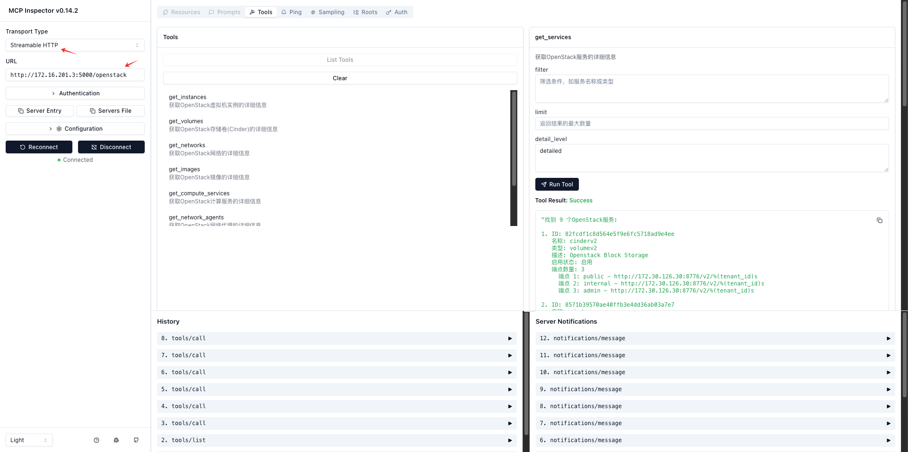

# OpenStack MCP Server

## Overview

An OpenStack resource query service based on MCP (Multimodal Capability Protocol), providing API interfaces to query compute, storage, network, image, and other resources from the OpenStack cloud platform.

## Features

- **Real-time Resource Queries**: Get the latest resource status of OpenStack clusters via API
- **Multi-dimensional Information**: Support querying various resources including compute, storage, network, and images
- **Flexible Filtering**: Filter resources by name, ID, and other conditions
- **Detail Level Control**: Support basic, detailed, and full information display levels
- **Standard MCP Interface**: Fully compatible with MCP protocol, seamlessly integrating with large language models

## Technical Architecture

- High-performance asynchronous HTTP service based on Starlette and Uvicorn
- Interact with OpenStack API using OpenStack SDK
- Provide structured OpenStack resource information to large language models through MCP protocol
- Support SSE streaming output for real-time feedback

### Architecture Diagram

```
┌─────────────┐    ┌─────────────┐    ┌─────────────┐
│             │    │             │    │             │
│  AI Client  │───▶│  MCP Server │───▶│  OpenStack  │
│  (LLM)      │◀───│  (Service)  │◀───│  API        │
│             │    │             │    │             │
└─────────────┘    └─────────────┘    └─────────────┘
```

## Installation

### Requirements

- Python 3.10+
- OpenStack environment

### Install via pip

```bash
pip install openstack-mcp-server
```

## Usage

### Start the Service

```bash
openstack-mcp-server --port 8000 --log-level INFO --auth-url 'http://<OpenStack-API-Endpoint>:5000/v3' --username '<OpenStack-Admin-User>' --password '<OpenStack-Admin-Password>'
```

After starting, the MCP interface will be available at `http://localhost:8000/openstack`.

### Parameters

- `--port`: Service listening port, default is 8000
- `--log-level`: Log level, options are DEBUG, INFO, WARNING, ERROR, CRITICAL, default is INFO
- `--json-response`: Use JSON response instead of SSE stream, default is False

### Interface Example

Through the MCP protocol, you can use the following tools to query OpenStack resources:

#### Get OpenStack VM Instances

```json
{
  "name": "get_instances",
  "arguments": {
    "filter": "web-server",
    "limit": 10,
    "detail_level": "detailed"
  }
}
```

Parameter description:
- `filter`: Filter condition, such as instance name or ID (optional)
- `limit`: Maximum number of results to return (optional, default 100)
- `detail_level`: Level of detail in the returned information, options are basic, detailed, full (optional, default detailed)

## Install from Source

```bash
# Clone repository
git clone https://github.com/wangshqly0407/openstack-mcp-server.git
cd openstack-mcp-server
# Create virtual environment
uv venv
# Activate virtual environment
source .venv/bin/activate
# Initialize runtime environment
uv sync
# Start streaming HTTP MCP server
uv run ./src/mcp_openstack_http/server.py --port 8000 --log-level INFO --auth-url 'http://<OpenStack-API-Endpoint>:5000/v3' --username '<OpenStack-Admin-User>' --password '<OpenStack-Admin-Password>'
```

## Testing and Verification

```bash
# Method 1: Test using npx
npx -y @modelcontextprotocol/inspector uv run ./src/mcp_openstack_http/server.py --port 8000 --log-level INFO --auth-url 'http://<OpenStack-API-Endpoint>:5000/v3' --username '<OpenStack-Admin-User>' --password '<OpenStack-Admin-Password>'

# Method 2: Test using docker
docker run -it --rm -p 6274:6274 -p 6277:6277 -v $(pwd):/app -w /app node:18 npx -y @modelcontextprotocol/inspector uv run ./src/mcp_openstack_http/server.py --port 8000 --log-level INFO --auth-url 'http://<OpenStack-API-Endpoint>:5000/v3' --username '<OpenStack-Admin-User>' --password '<OpenStack-Admin-Password>'
```

Access: http://localhost:6274/



## Development Extensions

### Adding New Resource Query Tools

1. Add corresponding resource acquisition functions in `src/mcp_openstack_http/server.py`
2. Register the new tool in the `list_tools` method
3. Implement the tool's processing logic in the `call_tool` method

## License

Apache 2.0 